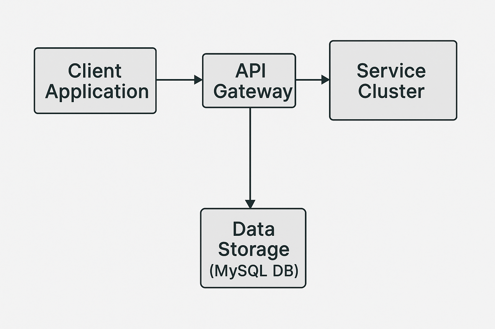
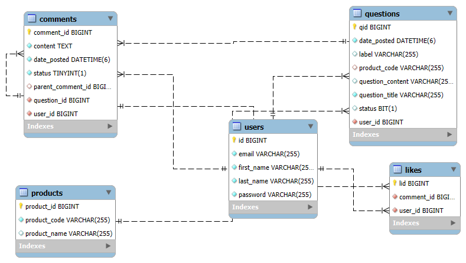

# 🛍️ Product Community Backend

A Spring Boot-based backend system for a **Product Community Web Application**, where users can register, post questions, comment, reply to comments, like responses, and interact within a community. Designed with a scalable service architecture using JWT authentication and MySQL for persistence.

---

## 📌 Project Features

- 🔐 **User Module**
    - User registration and authentication (JWT)
    - Secure access to APIs

- ❓ **Question Module**
    - Post new questions
    - Search and retrieve questions using filters
    - Close questions and select best answers

- 💬 **Comment Module**
    - Comment on questions
    - Like comments
    - Reply to comments

- 📈 **Statistics Module**
    - Homepage metrics like total users, questions, and comments
    - Cached responses for faster loading

---

## 🏗️ System Architecture


---
## ⚙️ Tech Stack

| Layer             | Technology                     |
|------------------|---------------------------------|
| Backend           | Spring Boot                    |
| Authentication    | JWT (JSON Web Token)           |
| ORM               | Hibernate (JPA)                |
| Database          | MySQL                          |
| Build Tool        | Maven                          |
| API Tool          | Postman/Swagger                |

---
## 🧩 Database Schema (ER Diagram Overview)


---

## 🚀 How to Run Locally

### ✅ Prerequisites

- Java 17+
- Maven 3.8+
- MySQL 8+
- Postman (for API testing)

### 🛠️ Steps

1. **Clone Repository**
   ```bash
   git clone https://github.com/your-username/product-community-backend.git
   cd product-community-backend
   ```
2. **Configure MySQL Database**
```bash
   CREATE DATABASE product_community;
   ```
3. **Update `application.properties`**
```bash
    spring.datasource.url=jdbc:mysql://localhost:3306/product_community
    spring.datasource.username=your_username
    spring.datasource.password=your_password
    ```
3. **Build the Project**
   ```bash
   mvn clean install
   mvn spring-boot:run
   ```
4. **Access the Application**
```bash
   - Open your browser and go to `http://localhost:8080`
   - Use Postman to test the APIs
 ```
## 📡 API Modules

### 🔐 User APIs

- `POST /api/auth/register`  
  Register a new user

- `POST /api/auth/login`  
  Login and receive a JWT token

---

### ❓ Question APIs

- `POST /api/questions`  
  Create a new question

- `GET /api/questions`  
  Retrieve all questions

- `GET /api/questions/search?keyword=xyz`  
  Search questions by keyword

- `PUT /api/questions/{id}/close`  
  Close a question

- `PUT /api/questions/{id}/select-answer/{commentId}`  
  Select a comment as the answer

---

### 💬 Comment APIs

- `POST /api/comments`  
  Post a comment or reply to another comment

- `PUT /api/comments/{id}/like`  
  Like a comment

---

### 📊 Statistics API

- `GET /api/stats/home`  
  Retrieve total user, question, and comment counts (cached for performance)
